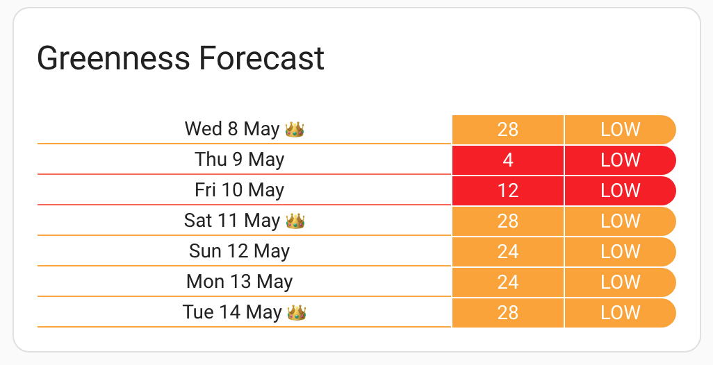

# Lovelace custom card for Octopus Energy Greenness Forecast

[](https://github.com/hacs/integration)

This lovelace card displays the Octopus Greener Days score data, pulling the data from sensors of the excellent [BottlecapDave/HomeAssistant-OctopusEnergy](https://github.com/BottlecapDave/) integration.

This provides a convenient, at a glance way to observe the weeks ahead Greener Days score provided by Octopus.

Each day is given a score out of 100.  The higher the score then greener the period, ie more renewables on the grid.

The timeframe Octopus analyse is 23:00 to 06:00 each day.

Octopus highlight which **evening** to plug in, to take advantage of the coming **overnight** energy.

#### Installation
##### HACS
The easiest way to install it is via [HACS (Home Assistant Community Store)](https://github.com/hacs/frontend). This will ensure you get updates automatically too.

Simply click this button to go directly to the details page:

[](https://my.home-assistant.io/redirect/hacs_repository/?owner=elyobelyob&repository=octopus-energy-greenness-forecast-card&category=plugin)

In the Home Assistant UI:
* Use HACS -> Frontend -> Top Right Menu -> Custom repositories
* Enter a repo of `elyobelyob/octopus-energy-greeness-card` and category of "Lovelace", and click the Add button
* Click "Explore & Download Repositories" and start searching for "octo" and you should see the entry
* Click "Download" in the bottom right

This should automatically configure all the resources, so you can now skip to **Configuration**.

##### Manually
You can also install manually by downloading/copying the Javascript file in to `$homeassistant_config_dir/www/community/` and then add the Javascript file to Lovelace in the Home Assistant UI by using
Settings -> Dashboards -> Top Right Menu -> Resources (Advanced Mode needs to be set in the user settings in Home Assistant).

#### Configuration
Add the card to your dashboard using **Add Card -> Custom: Octopus Energy Greeness Card**.

You'll need to then configure the yaml yourself - the `type` part is filled out for you.

The only **required** key is the name of the entity sensor that contains the current index.

You will need to enable this sensor with the name like sensor.octopus_energy_<your_id_here>_greenness_forecast_current_index.

The easiest way to find that entity name is by opening the Search within Home Assistant: search for `greeness_index` -> click the chosen result -> choose the Settings tab -> copy `Entity ID`.

Here's an example yaml configuration - obviously replacing `<your_id_here>` with your data from above.


```
type: custom:octopus-greenness-forecast-card
currentEntity: event.octopus_energy_electricity_<your_id_here>_greenness_forecast_current_index
lowlimit: 15
mediumlimit: 20
highlimit: 30
showTimes: true

```

Here's a breakdown of all the available configuration items:

| Name          | Optional | Default       | Description                                                                                                                                          |
|---------------|----------|---------------|:-----------------------------------------------------------------------------------------------------------------------------------------------------|
| currentEntity | N        | N/A           | Name of the sensor that contains the solar indexes you want to render, generated from the `HomeAssistant-OctopusEnergy` integration                  |
| title         | Y        | "Agile Rates" | The title of the card in the dashboard                                                                                                               |
| lowLimit      | Y        |  5 (pence)    | If the price is above `lowlimit`, the row is marked dark green. (this option is only applicable for import rates                                     |
| mediumLimit   | Y        | 20 (pence)    | If the price is above `mediumlimit`, the row is marked orange.                                                                                       |
| highLimit     | Y        | 30 (pence)    | If the price is above `highlimit`, the row is marked red.                                                                                            |
| showTimes     | Y        | false         | Whether you want to show the times this greeness index applies, normally 11:00PM - 06:00 AM                                                          |

#### A note on colouring

* If the index score is above `highLimit`, then the row is in green
* If the index score is above `mediumLimit`, then the row is coloured light green
* if the index score is above `lowLimit`, then the row is coloured orange
* if the index score is below `lowLimit`, then the row is coloured red

#### Screenshots


#### Thanks/inspiration
This card was based on and reworked from the code [lozzd/octopus-energy-rates-card](https://github.com/lozzd/octopus-energy-rates-card).

